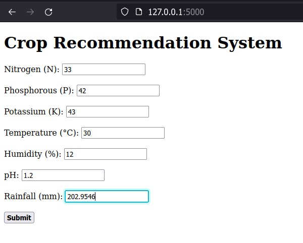

# Simple-DSS-Crop-Recommendation

This is a simple web app that creates recommendations for what crop should be planted. The decision making process is based of a trained model created using the J48 decision tree algorithm. The program determines the appropriate crop from these factors:
* N - ratio of Nitrogen content in soil
* P - ratio of Phosphorous content in soil
* K - ratio of Potassium content in soil
* temperature - temperature in degree Celsius
* humidity - relative humidity in %
* ph - ph value of the soil
* rainfall - rainfall in mm

### Dataset: https://www.kaggle.com/datasets/atharvaingle/crop-recommendation-dataset

This is a university project, feel free to use and contribute.
----
### Requirements for compilation:
* Flask python library  
* Re python library  

## Usage:
After running the script enter in your browser the address 127.0.0.1:5000. There you can can insert your values and get the reccomended crop.

    
        

